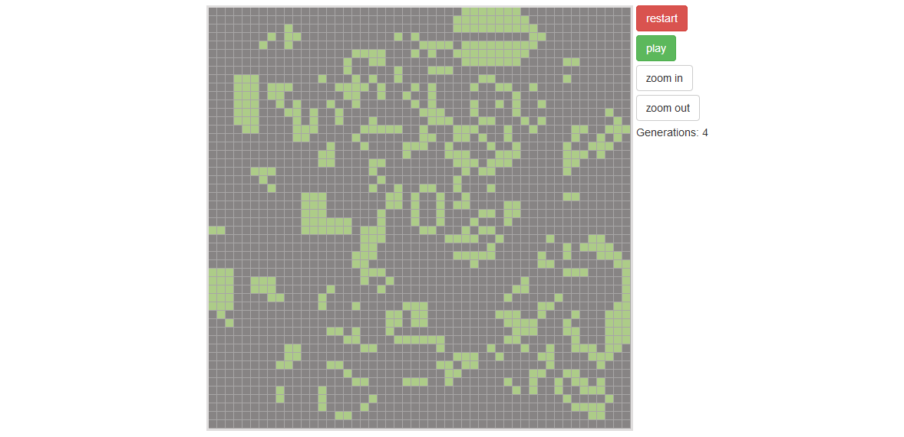

# Conway's Game of Life application with AngulerJS and Node.js



Set up backend
-------------

* Go to 'backend_node' folder
* Run 'npm install'

Set up frontend
-------------

* Go to 'frontend' folder
* Change config info in 'frontend/src/app/app.constants.js'
* Run 'npm install'
* Run 'bower install'
* Run 'gulp build'

Run backend
-------------

```
cd backend_node
npm run serve
```

Run frontend
-------------

```
cd frontend
npm run serve
```

